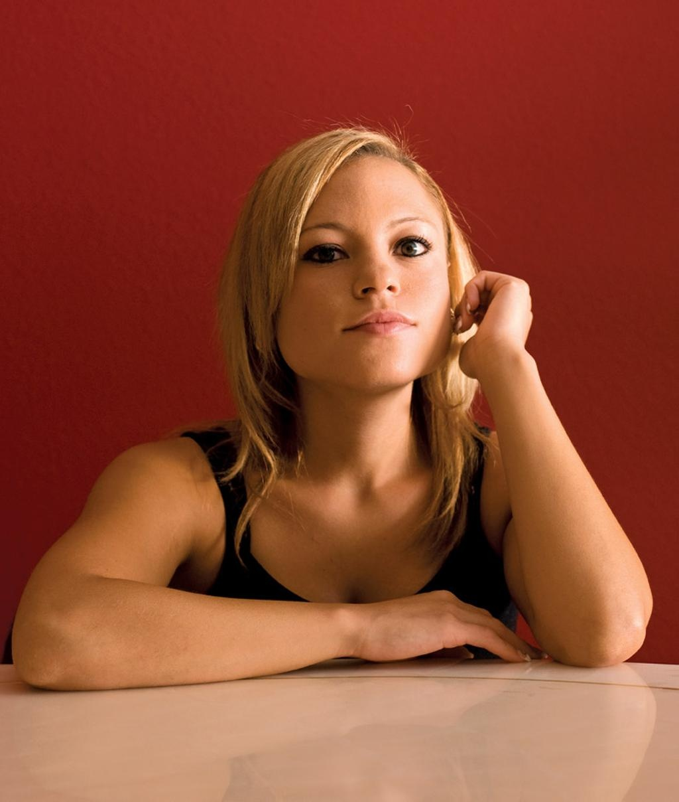
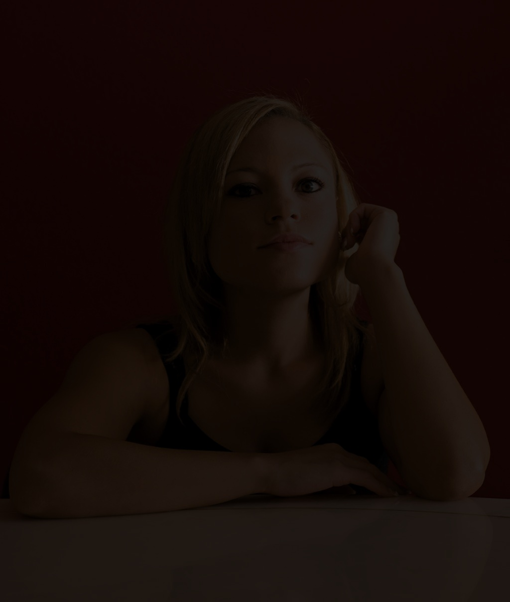
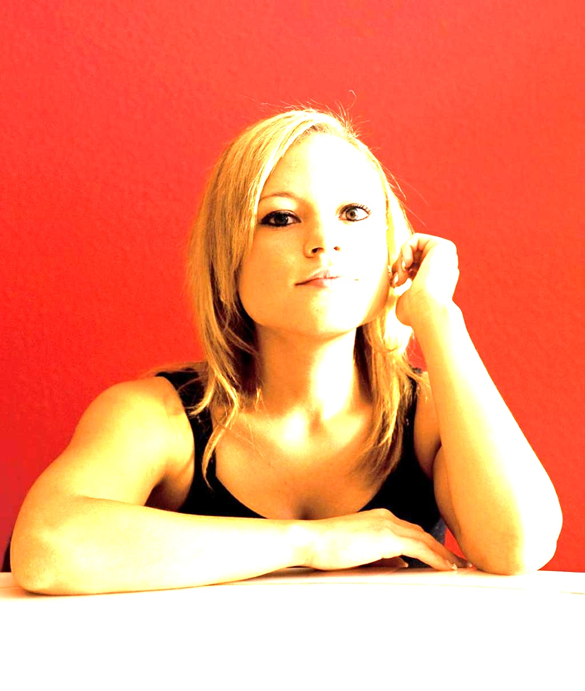
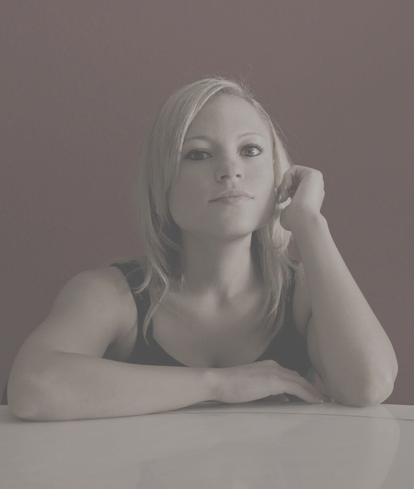

# 配套技术说明文档

本文档完整记录图像画质分析工具底层实现细节，涵盖图像解码规则、三大评分算法参数与固有缺陷、大图内存优化方案、实测对照数据及典型误判场景分析。

**1. 图片格式差异与解码注意事项**  
**2. 各评分模块算法来源、参数含义与局限性**  
**3. 超大图处理方案与性能说明**  
**4. 测试样本评分结果与人工主观判断对比**  
**5. 算法误判反例及误差原因分析**

## 一、图片格式差异与解码注意事项

### 1. 各图片格式核心差异
项目支持 JPG/JPEG、PNG、WebP、HEIC 四种图像格式，特性区别如下：  
**JPG/JPEG：** 有损压缩，无透明通道，文件体积小；高压缩率会产生色彩断层，压缩损伤会降低清晰度得分；  
**PNG：** 无损压缩，支持 Alpha 透明通道，色彩无损失；文件体积偏大，透明像素会干扰亮度、对比度统计；  
**WebP：** 兼顾有损 / 无损压缩，压缩效率优于 JPG；Qt 解码需配套插件支持；  
**HEIC：** 手机相机主流格式，压缩率极高；OpenCV 无原生解码器，依赖 Qt 图像组件解析，同等尺寸下解码耗时更长。  

### 2. 解码注意事项
**内存风险：** 12MP 以上原图完整加载占用内存高，易触发 OOM 崩溃，采用缩略图预览、原图分段计算分层方案规避崩溃；；  
**通道统一处理：** 所有格式图像统一转为 8 位灰度单通道参与运算，减少多通道计算开销；  
**校验规则：** 通过文件二进制头部识别真实图像类型，不依赖后缀，防止篡改后缀解析失败；  
**异常捕获：** 增加解码异常捕获逻辑，文件损坏、格式异常时输出日志提示，避免程序直接闪退。

## 二、各评分模块算法来源、参数含义与局限性

### 1. 清晰度模块
**算法来源：**  融合拉普拉斯方差、Tenengrad 梯度指标，并补充 Canny 边缘占比，多区域采样后加权融合打分。  
**关键参数：** 3×3 卷积核；选取 5 处中心 ROI；剔除五分之一极值取均值；三项指标权重 0.45、0.35、0.20；使用 Sigmoid 映射为 0-100 分值。  
**局限性：** 纯色低纹理图像易误判为模糊；夜景噪点易形成伪边缘，导致清晰度分数虚高。   

### 2. 曝光分析模块
**算法来源：** 基于灰度直方图统计，划分多区间计算欠曝、过曝像素占比，结合亮度均值自适应基准，对极端明暗占比进行非线性惩罚扣分。  
**关键参数：** 欠曝区间 0-50，过曝区间 206-255；占比做平方根非线性压缩；根据过 / 欠曝占比动态调整亮度基准。  
**局限性：** 夜景、雪景等艺术化明暗画面易判定失真；仅支持全局统计，无法识别局部过曝 / 死黑区域。  

### 3. 对比度模块
**算法来源：** 分块计算 Michelson 局部对比度，过滤平坦纯色区块后求取平均值。  
**关键参数：** 分块尺寸 8×8；平坦区域阈值 0.02；数值拉伸后做 Gamma 视觉矫正。  
**局限性：** 低光照图像分数普遍偏低；大面积纯色背景会拉低整体对比度得分。  

### 4. 综合加权规则
清晰度分项权重 40%、曝光分项权重 35%、对比度分项权重 25%，加权求和得到 0-100 综合画质总分。

## 三、超大图处理方案与性能说明 

### 分层计算策略平衡精度与内存、速度：  
**界面预览：** 大图统一生成缩放缩略图展示，降低界面渲染内存占用，避免卡顿；  
**清晰度计算：** 使用完整原图像素运算，保证清晰度检测精度不受缩放影响；  
**曝光、对比度计算：** 使用降采样缩放图运算，大幅缩短计算耗时；  
**性能标准：** 常规尺寸图片分析耗时控制在 1s 以内；长边超 3000 像素的超大图计算耗时会小幅上浮。

## 四、测试样本评分结果与人工判断对比

### 1. 测试样本分类
test_test_sample目录下包含五类标准测试素材：正常清晰图、轻度模糊图、欠曝图、过曝图、低对比度灰蒙蒙图，配套软件分析日志截图。  

### 2. 对比验证
人工根据人眼观感给出主观评级，与程序输出的分项分数、文字评级做对照记录。  
<table align="center" style="border-collapse:collapse;">
<tr>

<td align="center" style="vertical-align:top; padding:6px;">

评级：清晰，亮度稍低，对比度正常，得分：72

人工判定：画面清晰、亮度正常

</td>
<td align="center" style="vertical-align:top; padding:6px;">

评级：模糊，清晰度得分：48，总得分：59

人工判定：轻度模糊

</td>
<td align="center" style="vertical-align:top; padding:6px;">

评级：亮度严重偏低，亮度得分：27，总得分：28

人工判定：画面非常暗

</td>
<td align="center" style="vertical-align:top; padding:6px;">

评级：亮度严重偏高，亮度得分：64，总得分：71

人工判定：整体画面过曝

</td>
<td align="center" style="vertical-align:top; padding:6px;">

评级：对比度偏低，画面发灰，对比度得分：17，总得分：60

人工判定：整体画面发灰

</td>
</tr>
</table>

图1 测试样本评分与人工判定对比

### 3. 对比结论
程序打分、文字评级与人工主观判断基本保持一致，能够有效区分清晰、模糊、曝光异常、低对比度等画质问题。  

## 五、算法误判反例及误差原因分析

test_sample/fanli目录存放两类典型误判样本，记录现象与底层成因。  

### 反例 1：夜景星空、高噪点暗光照片

现象：清晰度分数偏高(98分)，误判画面清晰。  
原因：图像大量噪点会生成密集微小梯度，拉高拉普拉斯方差与梯度均值，算法无法区分真实细节与图像噪点。

### 反例 2：大面积雪景照片

现象：过曝占比高达69.5%，亮度严重偏高，评级为过曝。  
原因：雪景大面积白色天然集中在高亮度区间，但雪面纹理细节依然保留（直方图未贴右墙裁切），算法无法区分场景本身偏亮与真实过曝。

## 整体总结
本项目全部基于传统 OpenCV 图像处理算子实现，依靠灰度、梯度、分块对比度等底层统计特征，对日常拍摄的常规画质问题可给出贴合人眼观感的评分。  
但算法存在天然短板：仅依靠像素统计值，不具备图像语义理解能力，在夜景噪点、大面积高亮雪景等特殊场景容易产生误判。若需进一步提升感知一致性，可后续引入深度学习图像感知模型优化评分逻辑。  